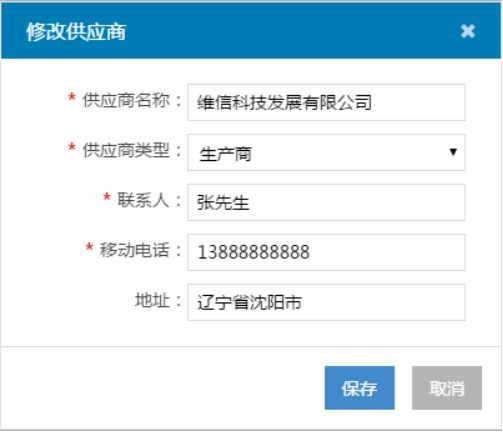
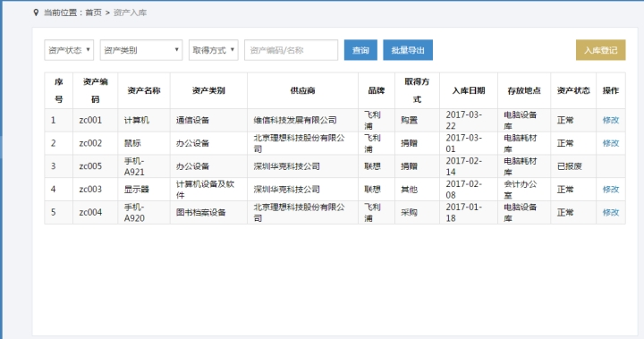
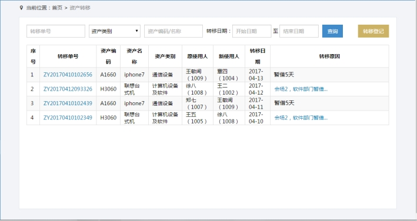
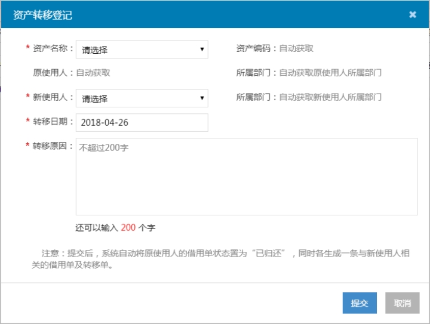

# 资产管理系统 需求说明书

# **1 引言**

## **1.1** **编写目的**

本文档将列举实现资产管理系统所需要的全部功能，并对每个功能给出简单的描述。

本文档的预期读者包括：最终用户，项目负责人，评审人员，产品人员，软件设计开发人员，测试人员。

## **1.2** **背景**

随着信息化时代的到来，实现资产的数字化网络化管理，是任何一个事业单位及企业的需求：通过计算机软件，使资产易于维护、方便查询，提高资产管理的准确性，进而提高工作效率。

## **1.3** **名词**、**缩略语**

| **名词/缩略语** | **解释**           |
| --------------- | ------------------ |
| ID              | 唯一标识码         |
| UI              | 软件的人机交互界面 |

## **1.4 参考资料**

无。

# **2 项目概述 **

## **2.1 建设目标**

本项目的目标是建立符合一般企业实际管理需求的资产管理系统，对企业的资产信息进行精确的维护，有效服务，从而减轻资产管理部门从事低层次信息处理和分析的负担，解放管理员的“双手大脑”，提高工作质量和效率。

## **2.2 技术要求**

本项目软件系统平台将达到主流Web应用软件的水平：

（1）功能方面：系统满足业务逻辑各功能需求的要求。

（2）易用性方面：通过使用主流的浏览器/服务器架构，保证用户使用本系统的易用性良好。

（3）安全性方面：系统对敏感信息（例如用户密码）进行相关加密；

（4）UI界面方面：界面简洁明快，用户体验良好，提示友好，必要的变动操作有“确认”环节等。

 

# **3 平台、角色和权限**

资产管理系统包含超级管理员和资产管理员两个角色。

超级管理员主要维护一些通用的字典；资产管理员维护部门、人员信息，并进行资产的日常管理。

| **角色名称**   | **模块菜单**                                 | **功能项**                                 |
| -------------- | -------------------------------------------- | ------------------------------------------ |
| **超级管理员** | 个人信息                                     | 查看超级管理员角色相关信息，可修改手机号码 |
| 资产类别       | 新增、修改、禁用、启用                       |                                            |
| 品牌           | 新增、修改、禁用、启用                       |                                            |
| 取得方式       | 新增、修改、禁用、启用                       |                                            |
| 供应商         | 新增、修改、禁用、启用、查询、查看详情       |                                            |
| 存放地点       | 新增、修改、禁用、启用、查询、查看详情       |                                            |
| **资产管理员** | 个人信息                                     | 查看资产管理员角色相关信息，可修改手机号码 |
| 资产类别       | 查看                                         |                                            |
| 品牌           | 查看                                         |                                            |
| 取得方式       | 查看                                         |                                            |
| 供应商         | 查询、查看详情                               |                                            |
| 存放地点       | 查询、查看详情                               |                                            |
| 部门管理       | 新增、修改                                   |                                            |
| 人员管理       | 新增、修改、删除、查询                       |                                            |
| 资产入库       | 入库登记、修改、查询、批量导出               |                                            |
| 资产借还       | 借用登记、归还、查询、查看借用单详情         |                                            |
| 资产转移       | 转移登记、查询、查看转移单详情、查看转移原因 |                                            |

# **4 业务需求**

## **4.1 登录页面**

### **4.1.1 业务描述**

资产管理员、超级管理员需要通过登录页面进入资产管理系统，登录页面是进入该系统的唯一入口。

### **4.1.2 需求描述**

首先选择角色，再输入有效的用户名、密码、任务ID和验证码，才能登录该系统。

### **4.1.3 行为人**

资产管理员，超级管理员。

### **4.1.4 UI页面 **

 

登录页

### **4.1.5 业务规则**

首先选择角色（系统默认选中“资产管理员”）；用户名为工号，用户获得密码和任务ID后，分别输入相应输入框，之后输入有效的验证码（点击【换一张】可更换验证码），点击【登录】即可登录该系统；

注意：资产管理员和超级管理员使用同一套账号密码登录，根据登录界面所选的角色，进入相应角色的操作界面：

Ø 若选择角色为“资产管理员”，并且用户名、密码、任务ID、验证码输入有效，登录后进入资产管理员首页，页面左侧显示该角色功能菜单项；

Ø 若选择角色为“超级管理员”，并且用户名、密码、任务ID、验证码输入有效，登录后进入超级管理员首页，页面左侧显示该角色功能菜单项；

## **4.2 首页**

### **4.2.1 业务*****\*描述**

资产管理员/超级管理员登录后，默认进入首页欢迎页面。

### **4.2.2 需求描述**

登录系统后进入的默认页面。

### **4.2.3 行为人**

资产管理员，超级管理员。

### **4.2.4 UI界面**

 

（超级管理员）首页

### **4.2.5 业务规则**

登录后默认进入首页欢迎页，页面title显示“首页”，面包屑导航显示“当前位置：首页”，页面显示欢迎语：欢迎！。

## **4.3 个人信息**

### **4.3.1 业务描述**

登录系统后，资产管理员/超级管理员可以查看个人信息，姓名、手机号、工号等，其中手机号初始为空，资产管理员/超级管理员可以进行修改；同时，也可以修改登录密码和退出系统。

因资产管理员和超级管理员使用同一个账号登录，任一角色修改手机号、登录密码后，对两个角色同时生效。

### **4.3.2 需求描述**

\1. 个人信息查看：

系统会显示资产管理员/超级管理员的姓名（学生姓名）、手机号、工号（为学生学号）、性别、部门、职位信息。

\2. 手机号编辑：

首次登录时为空，允许修改，只能输入以1开头的11位数字。

\3. 修改登录密码：

修改登录密码，修改成功后下次登录生效。

\4. 退出系统：

点击【退出】，退回到登录页，可以重新登录。

### **4.3.3 行为人**

资产管理员，超级管理员。

### **4.3.4 UI页面**

 

（资产管理员）个人信息页面

 

“修改密码”窗口

### **4.3.5 业务规则**

点击左侧导航栏中的“个人信息”模块菜单，进入个人信息页面：

\1. **个人信息页面：（资产管理员&超级管理员）**

Ø 页面title显示“个人信息”；

Ø 面包屑导航显示“当前位置：首页>个人信息”，点击“首页”可跳转至首页页面；

Ø 若是资产管理员，右侧管理界面显示用户姓名、手机号、工号、性别、部门（资产管理部门，只读）、职务（资产管理员，只读）；

Ø 若是超级管理员，右侧管理界面显示用户姓名、手机号、工号、性别、部门（资产管理部门，只读）、职务（超级管理员，只读）

Ø 首次登录时，手机号默认为空；输入有效手机号，点击【保存】，完成对手机号的编辑。

\2. **修改密码：**（注意，必填项使用红色星号“*”标注）**（资产管理员&超级管理员）**

Ø 点击页面右上角的【修改密码】，弹出“修改密码”窗口，可以修改登录密码；

Ø 当前密码、新密码及确认新密码必填；

Ø 当前密码必须正确；

Ø 新密码为6~10位字符，字母和数字的组合，区分大小写；

Ø 修改成功后下次登录需要使用新密码。

\3. **【退出】：（资产管理员&超级管理员）**

点击页面右上角的【退出】，可以退出该系统，返回登录页。如果再次登录，需要重新选择角色、输入用户名、密码、任务ID和验证码。

## **4.4 资产类别**

### **4.4.1 业务描述**

“资产类别”作为资产信息的属性而存在；该模块用于超级管理员对资产类别进行管理，资产管理员只能查看。

### **4.4.2 需求描述**

登录系统后，超级管理员可以对资产类别进行管理：包括资产类别的新增、修改、启用和禁用；资产管理员没有操作权限，只能进行资产类别的查看。

资产类别字段：类别编码、类别名称、状态、创建时间。

### **4.4.3 行为人**

资产管理员、超级管理员。

### **4.4.4 UI界面**

 

（超级管理员）资产类别：列表页

 

（超级管理员）资产类别：“新增资产类别”窗口

 

（超级管理员）资产类别：“修改资产类别”窗口

### **4.4.5 业务规则**

\1. **资产类别列表页：（资产管理员&超级管理员）**

Ø 点击左侧导航栏中的“资产类别”模块菜单，可进入资产类别管理页面，页面title显示“资产类别”；

Ø 面包屑导航显示“当前位置：首页>资产类别”，点击“首页”可跳转至首页页面；

Ø 列表按照类别创建时间降序显示全部的资产类别；

Ø 超级管理员：【新增】、【修改】、【禁用】按钮可见；

Ø 资产管理员：【新增】、【修改】、【禁用】按钮不可见；

\2. **新增资产类别：**（注意，必填项使用红色星号“*”标注）**（超级管理员）**

Ø 在资产类别列表页，点击【新增】按钮，弹出“新增资产类别”窗口；

Ø 类别名称：必填项，与系统内的资产类别名称不能重复，字符格式及长度要求：中文字符，不超过10位；

Ø 类别编码：必填项，与系统内的资产类别编码不能重复，字符格式及长度要求：6~8位字符，字母和数字的组合；

Ø 点击【保存】，保存当前新增内容，关闭当前窗口，回到列表页，在列表页新增一条记录，状态默认为“已启用”；

Ø 点击【取消】，不保存当前新增内容，关闭当前窗口，回到列表页。

\3. **修改资产类别：**（注意，必填项使用红色星号“*”标注）**（超级管理员）**

Ø 在资产类别列表页，点击【修改】按钮，弹出“修改资产类别”窗口，带入“类别名称”及“类别编码”信息；

Ø 类别名称：必填项，带入原值，修改时与系统内的资产类别名称不能重复，字符格式及长度要求：中文字符，不超过10位；

Ø 类别编码：必填项，带入原值，修改时与系统内的资产类别编码不能重复，字符格式及长度要求：6~8位字符，字母和数字的组合；

Ø 点击【保存】，保存当前编辑内容，关闭当前窗口，回到列表页，列表页相应内容随之更新；

Ø 点击【取消】，不保存当前编辑内容，关闭当前窗口，回到列表页，列表页相应内容前后不变。

\4. **禁用资产类别：（超级管理员）**

在资产类别列表页，点击“已启用”状态资产类别后的【禁用】按钮，系统弹出提示信息“您确定要禁用该资产类别吗？”：

Ø 点击【确定】，关闭提示信息，同时执行禁用操作；回到列表页，该类别状态变为“已禁用”；

Ø 点击【取消】，关闭提示信息，不执行禁用操作；回到列表页，该类别状态仍为“已启用”。

\5. **启用资产类别：（超级管理员）**

在资产类别列表页，点击“已禁用”状态资产类别后的【启用】按钮，系统弹出提示信息“您确定要启用该资产类别吗？”：

Ø 点击【确定】，关闭提示信息，同时执行启用操作；回到列表页，该类别状态变为“已启用”；

Ø 点击【取消】，关闭提示信息，不执行启用操作；回到列表页，该类别状态仍为“已禁用”。

## **4.5 品牌**

### **4.5.1 业务描述**

“品牌”作为资产信息的属性而存在；该模块用于超级管理员对品牌进行管理，资产管理员只能查看。

### **4.5.2 需求描述**

登录系统后，超级管理员可以对品牌进行管理：包括品牌的新增、修改、启用和禁用；资产管理员没有操作权限，只能进行品牌的查看。

品牌字段：品牌编码、品牌名称、状态、创建时间。

### **4.5.3 行为人**

资产管理员、超级管理员。

### **4.5.4 UI界面**

 

（超级管理员）品牌：列表页

 

（超级管理员）品牌：“新增品牌”窗口

 

（超级管理员）品牌：“修改品牌”窗口

### **4.5.5 业务规则**

\1. **品牌列表页：（资产管理员&超级管理员）**

Ø 点击左侧导航栏中的“品牌”模块菜单，可进入品牌管理页面；页面title显示“品牌”；

Ø 面包屑导航显示“当前位置：首页>品牌”，点击“首页”可跳转至首页页面；

Ø 列表按照品牌创建时间降序显示全部品牌；

Ø 超级管理员：【新增】、【修改】、【禁用】按钮可见；

Ø 资产管理员：【新增】、【修改】、【禁用】按钮不可见；

\2. **新增品牌：**（注意，必填项使用红色星号“*”标注）**（超级管理员）**

Ø 在品牌列表页，点击【新增】按钮，弹出“新增品牌”窗口；

Ø 品牌名称：必填项，与系统内的品牌名称不能重复，字符格式及长度要求：中文字符，不超过10位；

Ø 品牌编码：必填项，与系统内的品牌编码不能重复，字符格式及长度要求：6~8位字符，字母和数字的组合；

Ø 点击【保存】，保存当前新增内容，关闭当前窗口，回到列表页，在列表页新增一条记录，状态默认为“已启用”；

Ø 点击【取消】，不保存当前新增内容，关闭当前窗口，回到列表页。

\3. **修改品牌：**（注意，必填项使用红色星号“*”标注）**（超级管理员）**

Ø 在品牌列表页，点击【修改】按钮，弹出“修改品牌”窗口，显示带入的“品牌名称”及“品牌编码”信息；

Ø 品牌名称：必填项，带入原值，修改时与系统内的品牌名称不能重复，字符格式及长度要求：中文字符，不超过10位；

Ø 品牌编码：必填项，带入原值，修改时与系统内的品牌编码不能重复，字符格式及长度要求：6~8位字符，字母和数字的组合；

Ø 点击【保存】，保存当前编辑内容，关闭当前窗口，回到列表页，列表页相应内容随之更新；

Ø 点击【取消】，不保存当前编辑内容，关闭当前窗口，回到列表页，列表页相应内容前后不变。

\4. **禁用品牌：（超级管理员）**

在品牌列表页，点击“已启用”状态品牌后的【禁用】按钮，系统弹出提示信息“您确定要禁用该品牌吗？”：

Ø 点击【确定】，关闭提示信息，同时执行禁用操作；回到列表页，该品牌状态变为“已禁用”；

Ø 点击【取消】，关闭提示信息，不执行禁用操作；回到列表页，该品牌状态仍为“已启用”。

\5. **启用品牌：（超级管理员）**

在品牌列表页，点击“已禁用”状态品牌后的【启用】按钮，系统弹出提示信息“您确定要启用该品牌吗？”：

Ø 点击【确定】，关闭提示信息，同时执行启用操作；回到列表页，该品牌状态变为“已启用”；

Ø 点击【取消】，关闭提示信息，不执行启用操作；回到列表页，该品牌状态仍为“已禁用”。

## **4.6 取得方式**

### **4.6.1 业务描述**

“取得方式”作为资产信息的属性而存在；该模块用于超级管理员对取得方式进行管理，资产管理员只能查看。

### **4.6.2 需求描述**

登录系统后，超级管理员可以对取得方式进行管理：包括取得方式的新增、修改、启用和禁用；资产管理员没有操作权限，只能进行取得方式的查看。

取得方式字段：取得方式编码、取得方式名称、状态、创建时间。

### **4.6.3 行为人**

资产管理员、超级管理员。

### **4.6.4 UI界面**

 

（超级管理员）取得方式：列表页

 

（超级管理员）取得方式：“新增取得方式”窗口

 

（超级管理员）取得方式：“修改取得方式”窗口

### **4.6.5 业务规则**

\1. **取得方式列表页：（资产管理员&超级管理员）**

Ø 点击左侧导航栏中的“取得方式”模块菜单，进入取得方式管理页面，页面title显示“取得方式”；

Ø 面包屑导航显示“当前位置：首页>取得方式”，点击“首页”可跳转至首页页面；

Ø 列表按照取得方式创建时间降序显示全部取得方式；

Ø 超级管理员：【新增】、【修改】、【禁用】按钮可见；

Ø 资产管理员：【新增】、【修改】、【禁用】按钮不可见；

\2. **新增取得方式：**（注意，必填项使用红色星号“*”标注）**（超级管理员）**

Ø 在取得方式列表页，点击【新增】按钮，弹出“新增取得方式”窗口；

Ø 取得方式名称：必填项，与系统内的取得方式名称不能重复，字符格式及长度要求：中文字符，不超过10位；

Ø 取得方式编码：必填项，与系统内的取得方式编码不能重复，字符格式及长度要求：6~8位字符，字母和数字的组合；

Ø 点击【保存】，保存当前新增内容，关闭当前窗口，回到列表页，在列表页新增一条记录，状态默认为“已启用”；

Ø 点击【取消】，不保存当前新增内容，关闭当前窗口，回到列表页。

\3. **修改取得方式：**（注意，必填项使用红色星号“*”标注）**（超级管理员）**

Ø 在取得方式列表页，点击【修改】按钮，弹出“修改取得方式”窗口，显示带入的“取得方式名称”及“取得方式编码”信息；

Ø 取得方式名称：必填项，带入原值，修改时与系统内的取得方式名称不能重复，字符格式及长度要求：中文字符，不超过10位；

Ø 取得方式编码：必填项，带入原值，修改时与系统内的取得方式编码不能重复，字符格式及长度要求：6~8位字符，字母和数字的组合；

Ø 点击【保存】，保存当前编辑内容，关闭当前窗口，回到列表页，列表页相应内容随之更新；

Ø 点击【取消】，不保存当前编辑内容，关闭当前窗口，回到列表页，列表页相应内容前后不变。

\4. **禁用取得方式：（超级管理员）**

在取得方式列表页，点击“已启用”状态取得方式后的【禁用】按钮，系统弹出提示信息“您确定要禁用该取得方式吗？”：

Ø 点击【确定】，关闭提示信息，同时执行禁用操作；回到列表页，该取得方式状态变为“已禁用”；

Ø 点击【取消】，关闭提示信息，不执行禁用操作；回到列表页，该取得方式状态仍为“已启用”。

\5. **启用取得方式：（超级管理员）**

在取得方式列表页，点击“已禁用”状态取得方式后的【启用】按钮，系统弹出提示信息“您确定要启用该取得方式吗？”：

Ø 点击【确定】，关闭提示信息，同时执行启用操作；回到列表页，该取得方式状态变为“已启用”；

Ø 点击【取消】，关闭提示信息，不执行启用操作；回到列表页，该取得方式状态仍为“已禁用”。

## **4.7 供应商**

### **4.7.1 业务描述**

“供应商”作为资产信息的属性而存在；该模块用于超级管理员对供应商进行管理，资产管理员只能查看。

### **4.7.2 需求描述**

登录系统后：

\1. 超级管理员可以新增、修改、启用、禁用、查询、查看供应商信息；

\2. 资产管理员可以查询、查看供应商信息；

\3. 供应商详情：供应商名称、类型、状态、联系人、移动电话、地址；

\4. 供应商查询：支持按照供应商的状态、供应商类型及供应商名称（模糊查询）进行单个条件或组合条件查询。

### **4.7.3 行为人**

资产管理员，超级管理员。

### **4.7.4 UI页面**

 

（超级管理员）供应商：列表页

 

（超级管理员）供应商：“新增供应商”窗口

 

（超级管理员）供应商：“修改供应商”窗口

 

供应商：供应商详情窗口

### **4.7.5 业务规则**

\1. **供应商列表页：（资产管理员&超级管理员）**

Ø 点击左侧导航栏中的“供应商”模块菜单，可进入供应商管理页面，页面title显示“供应商”；

Ø 面包屑导航显示“当前位置：首页>供应商”，点击“首页”可跳转至首页页面；

Ø 列表按照供应商创建时间降序排列；

Ø 资产管理员有查询及查看供应商详情的权限；

Ø 超级管理员可以查询、新增、修改、启用、禁用、查看供应商详情。

\2. **新增供应商：**（注意，必填项使用红色星号“*”标注）**（超级管理员）**

Ø 在供应商列表页，点击【新增】按钮，弹出“新增供应商”窗口；

Ø 供应商名称：必填项，与系统内的供应商名称不能重复，字符格式及长度要求：中文字符，不超过30位；

Ø 供应商类型：必填项，默认“请选择”；下拉选项为：生产商、代理商、零售、其他；

Ø 联系人：必填项，字符格式及长度要求：中文字符，不超过20位；

Ø 移动电话：必填项，字符格式及长度要求：11位有效手机号码；

Ø 地址：非必填项，字符长度不超过30位；

Ø 点击【保存】，保存当前新增内容，关闭当前窗口，回到列表页，在列表页新增一条记录，状态默认为“已启用”；

Ø 点击【取消】，不保存当前新增内容，关闭当前窗口，回到列表页。

\3. **修改供应商：**（注意，必填项使用红色星号“*”标注）**（超级管理员）**

Ø 在供应商列表页，点击【修改】按钮，弹出“修改供应商”窗口；

Ø 供应商名称：必填项，默认带入原值，修改时与系统内的供应商名称不能重复，字符格式及长度要求：中文字符，不超过30位；

Ø 供应商类型：必填项，默认带入原值；下拉选项为：生产商、代理商、零售、其他；

Ø 联系人：必填项，默认带入原值；字符格式及长度要求：中文字符，不超过20位；

Ø 移动电话：必填项，默认带入原值；字符格式及长度要求：11位有效手机号码；

Ø 地址：非必填项，默认带入原值；字符长度不超过30位；

Ø 点击【保存】，保存当前编辑内容，关闭当前窗口，回到列表页，列表页相应内容随之更新；

Ø 点击【取消】，不保存当前编辑内容，关闭当前窗口，回到列表页，列表页相应内容前后不变。

\4. **禁用供应商：（超级管理员）**

在供应商列表页，点击“已启用”状态供应商后的【禁用】按钮，系统弹出提示信息“您确定要禁用该供应商吗？”：

Ø 点击【确定】，关闭提示信息，执行禁用操作；回到列表页，该供应商状态变为“已禁用”；

Ø 点击【取消】，关闭提示信息，不执行禁用操作；回到列表页，该供应商状态仍为“已启用”。

\5. **启用供应商：（超级管理员）**

在供应商列表页，点击“已禁用”状态供应商后的【启用】按钮，系统弹出提示信息“您确定要启用该供应商吗？”：

Ø 点击【确定】，关闭提示信息，同时执行启用操作；回到列表页，该供应商状态变为“已启用”；

Ø 点击【取消】，关闭提示信息，不执行启用操作；回到列表页，该供应商状态仍为“已禁用”。

\6. **查看供应商详情：（资产管理员&超级管理员）**

Ø 在供应商列表页，点击列表任意“供应商名称”，弹出“资产供应商详情”窗口，显示供应商名称、类型、状态、联系人、移动电话、地址信息，点击【关闭】按钮，关闭当前窗口，回到列表页。

\7. **供应商查询：（资产管理员&超级管理员）**

Ø 系统支持单个条件查询及组合查询，“供应商名称”支持模糊查询；

Ø 在供应商列表页，选择供应商状态、供应商类型，输入供应商名称，点击【查询】按钮，系统显示符合条件的供应商信息。

## **4.8 存放地点**

### **4.8.1 业务描述**

“存放地点”作为资产信息的属性而存在；该模块用于超级管理员对存放地点进行管理，资产管理员只能查看。

### **4.8.2 需求描述**

登录系统后：

\1. 超级管理员可以新增、修改、启用、禁用、查询、查看存放地点详情；

\2. 资产管理员可以查询、查看存放地点详情；

\3. 存放地点详情：存放地点名称、存放地点类型、备注；

\4. 存放地点查询：支持按照存放地点的状态、类型及存放地点名称（模糊查询）进行单个条件或组合条件查询。

### **4.8.3 行为人**

资产管理员，超级管理员。

### **4.8.4 UI页面**

 

（超级管理员）存放地点：列表页

 

（超级管理员）存放地点：“新增存放地点”窗口

 

（超级管理员）存放地点：“修改存放地点”窗口

 

存放地点：存放地详情窗口

### **4.8.5 业务规则**

\1. **存放地点列表页：（资产管理员&超级管理员）**

Ø 点击左侧导航栏中的“存放地点”模块菜单，可进入存放地点管理页面，页面title显示“存放地点”；

Ø 面包屑导航显示“当前位置：首页>存放地点”，点击“首页”可跳转至首页；

Ø 列表按照存放地点创建时间降序排列；

Ø 资产管理员有查询和查看存放地点详情的权限；

Ø 超级管理员可以查询、新增、修改、启用、禁用、查看存放地点详情。

\2. **新增存放地点：**（注意，必填项使用红色星号“*”标注）**（超级管理员）**

Ø 在存放地点列表页，点击【新增】按钮，弹出“新增存放地点”窗口；

Ø 存放地点名称：必填项，与系统内的存放地点名称不能重复，字符长度不超过30位；

Ø 存放地点类型：必填项，默认“请选择”；下拉选项为：固定资产、耗材物品、其他；

Ø 备注：非必填项，字符长度不超过50位；

Ø 点击【保存】，保存当前新增内容，关闭当前窗口，回到列表页，在列表页新增一条记录，状态默认为“已启用”；

Ø 点击【取消】，不保存当前新增内容，关闭当前窗口，回到列表页。

\3. **修改存放地点：**（注意，必填项使用红色星号“*”标注）**（超级管理员）**

Ø 在存放地点列表页，点击【修改】按钮，弹出“修改存放地点”窗口；

Ø 存放地点名称：必填项，默认带入原值，修改时与系统内的存放地点名称不能重复，字符长度不超过30位；

Ø 存放地点类型：必填项，默认带入原值；下拉选项为：固定资产、耗材物品、其他；

Ø 备注：非必填项，默认带入原值；字符长度不超过50位；

Ø 点击【保存】，保存当前编辑内容，关闭当前窗口，回到列表页，列表页相应内容随之更新；

Ø 点击【取消】，不保存当前编辑内容，关闭当前窗口，回到列表页，列表页相应内容前后不变。

\4. **禁用存放地点：（超级管理员）**

在存放地点列表页，点击“已启用”状态存放地点后的【禁用】按钮，系统弹出提示信息“您确定要禁用该存放地点吗？”：

Ø 点击【确定】，关闭提示信息，执行禁用操作；回到列表页，该存放地点状态变为“已禁用”；

Ø 点击【取消】，关闭提示信息，不执行禁用操作；回到列表页，该存放地点状态仍为“已启用”。

\5. **启用存放地点：（超级管理员）**

在存放地点列表页，点击“已禁用”状态存放地点后的【启用】按钮，系统弹出提示信息“您确定要启用该存放地点吗？”：

Ø 点击【确定】，关闭提示信息，同时执行启用操作；回到列表页，该存放地点状态变为“已启用”；

Ø 点击【取消】，关闭提示信息，不执行启用操作；回到列表页，该存放地点状态仍为“已禁用”。

\6. **查看存放地点详情：**

Ø 在存放地点列表页，点击列表任意“存放地点名称”，弹出“查看存放地点详情”窗口，显示存放地点名称、存放地点类型、备注信息，点击【关闭】按钮，关闭当前窗口，回到列表页。

\7. **存放地点查询：**

Ø 系统支持单个条件查询及组合查询，“存放地点名称”支持模糊查询；

Ø 在存放地点列表页，选择存放地点状态、存放地点类型，输入存放地点名称，点击【查询】按钮，系统显示符合条件的存放地点信息。

## **4.9 部门管理**

### **4.9.1 业务描述**

该模块用于资产管理员对组织机构信息进行管理；该模块超级管理员不可见。

### **4.9.2 需求描述**

登录系统后：资产管理员可以新增、修改部门信息；

部门字段：部门编码、部门名称、创建时间。

### **4.9.3 行为人**

资产管理员

### **4.9.4 UI界面**

 

部门管理：列表页

 

部门管理：“新增部门”窗口

 

部门管理：“修改部门”窗口

### **4.9.5 业务规则**

\1. **部门管理列表页：**

Ø 点击左侧导航栏中的“部门管理”模块菜单，可进入部门管理页面，页面title显示“部门管理”；

Ø 面包屑导航显示“当前位置：首页>部门管理”，点击“首页”跳转至首页页面；

Ø 列表按照部门创建时间降序排列；

Ø 资产管理员可以新增、修改部门信息；

Ø 超级管理员该菜单不可见；

\2. **新增部门：**（注意，必填项使用红色星号“*”标注）

Ø 在部门列表页，点击【新增】按钮，弹出“新增部门”窗口；

Ø 部门名称：必填项，与系统内的部门名称不能重复，字符格式及长度要求：中文字符，不超过10位；

Ø 部门编码：必填项，与系统内的部门编码不能重复，字符长度限制：不超过10位，字符格式为“英文字母及数字的组合”；

Ø 点击【保存】，保存当前新增内容，关闭当前窗口，回到列表页，在列表页新增一条记录；

Ø 点击【取消】，不保存当前新增内容，关闭当前窗口，回到列表页。

\3. **修改部门：**（注意，必填项使用红色星号“*”标注）

Ø 在部门列表页，点击【修改】按钮，弹出“修改部门”窗口，显示带入的“部门名称”及“部门编码”信息；

Ø 部门名称：必填项，带入原值，修改时与系统内的部门名称不能重复，字符格式及长度要求：中文字符，不超过10位；

Ø 部门编码：必填项，带入原值，修改时与系统内的部门编码不能重复，字符长度限制：不超过10位，字符格式为“英文字母及数字的组合”；

Ø 点击【保存】，保存当前编辑内容，关闭当前窗口，回到列表页，列表页相应内容随之更新；

Ø 点击【取消】，不保存当前编辑内容，关闭当前窗口，回到列表页，列表页相应内容前后不变。

## **4.10 人员管理**

### **4.10.1 业务描述**

该模块用于资产管理员对人员信息进行管理；该模块超级管理员不可见。

### **4.10.2 需求描述**

登录系统后：资产管理员可以新增、修改、删除员工信息；

人员字段：姓名、工号、所属部门。

### **4.10.3 行为人**

资产管理员

### **4.10.4 UI界面**

 

人员管理：列表页

 

人员管理：“新增人员”窗口

 

人员管理：“修改员工”窗口

### **4.10.5 业务规则**

\1. **人员管理列表页：**

Ø 点击左侧导航栏中的“人员管理”模块菜单，可进入人员管理页面，页面title显示“人员管理”；

Ø 面包屑导航显示“当前位置：首页>人员管理”，点击“首页”跳转至首页页面；

Ø 列表按照员工工号升序排列；

Ø 资产管理员可以新增、修改、删除员工信息；

Ø 超级管理员该菜单不可见；

Ø 当列表记录超过10条时，列表显示翻页功能。

\2. **新增人员：**（注意，必填项使用红色星号“*”标注）

Ø 在人员列表页，点击【新增】按钮，弹出“新增人员”窗口；

Ø 姓名：必填项，字符长度：10字以内；

Ø 工号：必填项，与系统内的员工工号（包括已删除员工）不能重复，字符格式及长度要求：4位数字，不能以0开头；

Ø 所属部门：必填项，默认“请选择”，下拉选项取自部门字典；

Ø 点击【保存】，保存当前新增内容，关闭当前窗口，回到列表页，在列表页新增一条记录；

Ø 点击【取消】，不保存当前新增内容，关闭当前窗口，回到列表页。

\3. **修改人员：**（注意，必填项使用红色星号“*”标注）

Ø 在员工列表页，点击【修改】按钮，弹出“修改人员”窗口；

Ø 姓名：必填项，带入原值，字符长度：10字以内；

Ø 工号：必填项，带入原值，修改时与系统内的员工工号（包括已删除员工）不能重复，字符格式及长度要求：4位数字，不能以0开头；

Ø 点击【保存】，保存当前编辑内容，关闭当前窗口，回到列表页，列表页相应内容随之更新；

Ø 点击【取消】，不保存当前编辑内容，关闭当前窗口，回到列表页，列表页相应内容前后不变。

\4. **删除人员：**

在人员列表页，点击任意员工后的【删除】按钮，系统首先验证该员工有无正在借用的资产：

Ø 若有，则弹窗提示“该员工有正在借用的资产，请先归还资产，再进行删除。”；

Ø 若无，则弹窗提示“您确定要删除该员工吗？”：

n 点击【确定】，执行删除操作，回到列表页，列表页少该条记录；

n 点击【取消】，不执行删除操作，回到列表页，列表页该条记录仍存在；

\5. **查询人员：**

Ø 系统支持单个条件查询及组合查询，员工“姓名或工号”支持模糊查询；

Ø 在人员列表页，选择所属部门，输入员工姓名或工号，点击【查询】按钮，系统显示符合条件的人员信息。

## **4.11 资产入库**

### **4.11.1 业务描述**

该模块用于资产管理员对资产的入库过程进行管理；超级管理员该菜单不可见。

### **4.11.2 需求描述**

登录系统后，资产管理员可以进行资产入库登记、修改、查询、导出资产信息；资产入库后资产状态默认为“正常”，“正常”状态的资产可进行修改；“已报废”状态的资产“存放地点”取值为空，不可修改。

资产字段：资产编码、资产名称、资产类别、供应商、品牌、取得方式、入库日期、存放地点、资产图片、资产状态（包括正常和已报废）。

### **4.11.3 行为人**

资产管理员

### **4.11.4 UI页面**

 

资产入库：列表页

 

资产入库：“资产入库登记”窗口

 

资产入库：“修改资产信息”窗口

### **4.11.5 业务规则**

\1. **资产入库列表页：**

Ø 点击左侧导航栏中的“资产入库”模块菜单，可进入资产入库管理页面，页面title显示“资产入库”；

Ø 面包屑导航显示“当前位置：首页>资产入库”，点击“首页”跳转至首页页面；

Ø 列表按照资产入库日期降序（入库日期相同的，按照登记时间降序）显示全部资产信息；

Ø 当列表记录超过10条时，列表显示翻页功能。

\2. **资产入库登记：**（注意，必填项使用红色星号“*”标注）

Ø 在资产列表页，点击【入库登记】按钮，弹出“资产入库登记”窗口，窗口下方显示注意事项“注意：提交后，“资产编码”不允许修改，请认真填写。”；

Ø 资产名称：必填项，与系统内的资产名称不能重复，字符长度不超过30位；

Ø 资产编码：必填项，与系统内的资产编码不能重复，字符格式及长度要求：字母或数字，不超过6位字符；

Ø 资产类别：必填项，从下拉菜单中选择资产类别（来自资产类别字典中“已启用”状态的记录），默认为“请选择”；

Ø 供应商：必填项，从下拉菜单中选择供应商（来自供应商字典中“已启用”状态的记录），默认为“请选择”；

Ø 品牌：必填项，从下拉菜单中选择品牌（来自品牌字典中“已启用”状态的记录），默认为“请选择”；

Ø 取得方式：必填项，从下拉菜单中选择取得方式（来自取得方式字典中“已启用”状态的记录），默认为“请选择”；

Ø 入库日期：必填项，默认为“当天日期”；

Ø 存放地点：必填项，从下拉菜单中选择存放地点（来自存放地点字典中“已启用”状态的记录），默认为“请选择”；

Ø 资产图片：非必填；格式为常见图片格式，文件大小限制为（≤3M）；最多只能上传一张图片，允许删除图片重新上传；

Ø 点击【提交】，保存当前新增内容，返回至列表页，在列表页新增一条记录，状态默认为“正常”；

Ø 点击【取消】，不保存当前新增内容，返回至列表页。

\3. **修改资产信息：**（注意，必填项使用红色星号“*”标注）

Ø 在资产入库管理列表页，点击“正常”状态资产后的【修改】按钮，弹出“修改资产信息”窗口；

Ø 资产名称：必填项，带入原值，修改时与系统内的资产名称不能重复，字符长度不超过30位；

Ø 资产编码：显示录入的资产编码值，只读不可修改；

Ø 资产类别：必填项，带入原值（若原资产类别已禁用，则显示“请选择”），修改时从下拉菜单中选择资产类别（来自资产类别字典中“已启用”状态的记录）；

Ø 供应商：必填项，带入原值（若原供应商已禁用，则显示“请选择”），修改时从下拉菜单中选择供应商（来自供应商字典中“已启用”状态的记录）；

Ø 品牌：必填项，带入原值（若原品牌已禁用，则显示“请选择”），修改时从下拉菜单中选择品牌（来自品牌字典中“已启用”状态的记录）；

Ø 取得方式：必填项，带入原值（若原取得方式已禁用，则显示“请选择”），修改时从下拉菜单中选择取得方式（来自取得方式字典中“已启用”状态的记录）；

Ø 入库日期：必填项，带入原值，修改时从日历控件中选择日期；

Ø 存放地点：必填项，带入原值（若原存放地点已禁用，则显示“请选择”），修改时从下拉菜单中选择存放地点（来自存放地点字典中“已启用”状态的记录）；

Ø 资产状态：固定为“正常”，只读不可修改；

Ø 资产图片：非必填；格式为常见图片格式，文件大小限制为（≤3M）；若之前已上传图片，则显示资产图片缩略图，允许删除图片重新上传；

Ø 点击【提交】，保存当前编辑内容，返回至列表页，列表页相应内容随之更新；

Ø 点击【取消】，不保存当前编辑内容，返回至列表页，列表页相应内容前后不变。

\4. **资产查询：**

Ø 系统支持使用“资产编码/名称”进行模糊查询；

Ø “资产状态”筛选条件包括“正常”、“已报废”；

Ø “资产类别”筛选条件包含所有已启用、已禁用的类别；

Ø “取得方式”筛选条件包含所有已启用、已禁用的方式；

Ø 在资产列表页，选择资产状态、资产类别、取得方式，输入资产编码或名称，点击【查询】按钮，系统显示符合条件的资产信息。

\5. **批量导出：**

Ø 导出记录范围：导出查询结果；

Ø 查询结果为空时，执行导出，提示“暂时没有可以导出的记录！”；

Ø 导出字段：序号、资产编码、资产名称、资产类别、供应商、品牌、取得方式、入库日期、存放地点、资产状态；

Ø 导出文件命名规则：资产信息_导出日期；

## **4.12 资产借还**

### **4.12.1 业务描述**

该模块用于资产管理员对资产的借还过程进行管理；超级管理员该菜单不可见。

### **4.12.2 需求描述**

登录系统后，资产管理员可以进行资产借用登记、归还、查询以及查看资产借还信息。

资产借用登记后，资产的归还状态变为“未归还”；归还该资产后，状态变为“已归还”。

### **4.12.3 行为人**

资产管理员

### **4.12.4 UI界面**

 

资产借还：列表页

 

资产借还：资产借用登记窗口

 

资产借还：“资产归还”窗口

 

资产借还：“资产借用单详情”窗口

### **4.12.5 业务规则**

\1. **资产借还列表页：**

Ø 点击左侧导航栏中的“资产借还”模块菜单，进入资产借还管理页面，页面title显示“资产借还”；

Ø 面包屑导航显示“当前位置：首页>资产借还”，点击“首页”跳转至首页页面；

Ø 列表按照资产借用日期降序（借用日期相同的，按照登记时间降序）排列；

Ø 借用原因：借用原因＜=10字时，正常显示，不带链接效果；借用原因若超过10个字，则截断，其后使用省略号…表示，带蓝色链接效果，点击可查看借用原因详情；

Ø 当列表记录超过10条时，列表显示翻页功能。

\2. **查看资产借用原因：**

Ø 借用原因若超过10个字，则截断，其后使用省略号…表示，带蓝色链接效果，点击可查看借用原因详情。

\3. **资产借用登记：**（注意，必填项使用红色星号“*”标注）

Ø 在资产借用列表页，点击【借用登记】按钮，打开“资产借用登记”窗口；

Ø 资产名称：必填项，默认为“请选择”，在下拉列表中进行选择（只能选择“已归还”并且资产状态为“正常”的资产）；

Ø 资产编码：选择合适的资产名称后，由系统自动获取相应的资产编码；

Ø 使用人：必填项，默认为“请选择”，在下拉列表中进行选择；

Ø 所属部门：选择使用人后，由系统自动获取该使用人所在的部门名称；

Ø 借用日期：必填项，为日历控件，日期默认为“当天”，可选择“当天以前”、“当天”或“当天以后”的日期；

Ø 借用原因：必填项，默认为空，字符长度限制：不超过200字；

Ø 点击【提交】，保存当前登记信息，系统自动生成资产借用单号（生成规则：“JY”+时间戳）；同时返回至列表页，在列表页新增一条记录，状态为“未归还”，操作栏显示【归还】按钮；

Ø 点击【取消】，不保存当前登记内容，返回至列表页。

\4. **资产归还：**（注意，必填项使用红色星号“*”标注）

Ø 在资产借还管理列表页，点击“未归还”状态记录后的【归还】按钮，弹出“资产归还”窗口，显示资产信息及借用信息；

Ø 资产信息：资产名称、资产编码、资产类别、供应商、品牌、取得方式、存放地点、入库日期自动带入，不可修改；

Ø 借用信息：借用单号、使用人、所属部门、借用日期、借用原因自动带入，不可修改；

Ø 归还日期：必填项，为日历控件，日期默认为“当天”，归还日期不能早于借用日期；

Ø 备注：非必填项，默认为空，字符长度限制：不超过200字；

Ø 点击【提交】，保存当前内容，关闭当前窗口，回到列表页，列表该记录后显示相应的“归还日期”，状态变为“已归还”，操作栏为空；

Ø 点击【取消】，不保存当前内容，关闭当前窗口，回到列表页，列表页相应内容前后不变。

\5. **资产借用查询：**

Ø 系统支持单个条件查询及组合条件查询；支持使用“借用单号”进行精确查询，使用“使用人姓名/工号”、“资产编码/名称”进行模糊查询；

Ø “归还状态”筛选条件包括“已归还”、“未归还”；

Ø “资产类别”筛选条件包含所有已启用、已禁用的类别；

Ø 在资产借用列表页，输入借用单号、使用人姓名或工号、资产编码或名称，选择归还状态、资产类别，点击【查询】按钮，系统显示符合条件的资产借用记录。

\6. **查看借用单详情：**

Ø 在资产借还管理列表页，点击任意“借用单号”，弹出“资产借用单详情”窗口，显示资产信息及借用信息；

Ø 资产信息：资产名称、资产编码、资产类别、供应商、品牌、取得方式、存放地点、入库日期自动带入，不可修改；

Ø 借用信息：借用单号、使用人（姓名/工号）、所属部门、借用日期、借用原因、归还日期、备注自动带入，不可修改；

Ø 点击【关闭】按钮，关闭当前窗口，回到资产借还管理列表页。

## **4.13 资产转移**

### **4.13.1 业务描述**

对于借出未归还的资产，资产管理员可进行资产转移，转移给新的使用人。该模块用于资产管理员对资产的转移过程进行管理，由资产管理员记录资产转移的流水；超级管理员该菜单不可见。

### **4.13.2 需求描述**

登录系统后，资产管理员可以进行资产转移登记、查询以及查看资产转移信息。

资产管理员仅记录资产转移流水，完成转移登记操作后，系统自动将原使用人的借用单状态置为“已归还”，同时各生成一条关于新使用人的借用单和转移单。

### **4.13.3 行为人**

资产管理员

### **4.13.4 UI界面**

 

资产转移：列表页

 

资产转移：“资产转移登记”窗口

 

资产转移：“资产转移单详情”窗口

### **4.13.5 业务规则**

\1. **资产转移列表页：**

Ø 点击左侧导航栏中的“资产转移”模块菜单，进入资产转移管理页面，页面title显示“资产转移”；

Ø 面包屑导航显示“当前位置：首页>资产转移”，点击“首页”跳转至首页页面；

Ø 列表按照资产转移日期降序（转移日期相同的，按照登记时间降序）排列；

Ø 当列表记录超过10条时，列表显示翻页功能。

\2. **资产转移登记：**（注意，必填项使用红色星号“*”标注）

Ø 在资产转移列表页，点击【转移登记】按钮，打开“资产转移登记”窗口；

Ø 资产名称：必填项，默认为“请选择”，在下拉列表中进行选择（只能选择归还状态为“未归还”的资产）；

Ø 资产编码：选择合适的资产名称后，由系统自动获取相应的资产编码；

Ø 原使用人：选择合适的资产名称后，由系统自动带出该资产当前的使用人姓名和工号；

Ø （原使用人）所属部门：选择合适的资产名称后，由系统自动获取当前使用人的所在部门信息；

Ø 新使用人：必填项，默认为“请选择”，在下拉列表中进行选择；

Ø （新使用人）所属部门：选择新使用人后，由系统自动获取该使用人所在的部门名称；

Ø 转移日期：必填项，为日历控件，日期默认为“当天”，可选择“当天以前”、“当天”或“当天以后”的日期；

Ø 转移原因：必填项，默认为空，字符长度限制：不超过200字；

Ø 点击【提交】：

n 保存当前登记信息，系统自动生成关于新使用人的资产转移单（生成规则：“ZY”+时间戳），返回至资产转移列表页；

n 同时，在资产借还列表，系统自动将原使用人的借用单状态“未归还”置为“已归还”，归还日期取转移日期，备注为“资产转移：新使用人姓名（工号）”；

n 另，在资产借还列表，系统将自动生成关于新使用人的借用单，状态为“未归还”，借用日期取转移日期，借用原因取转移原因；

Ø 点击【取消】，不保存当前登记内容，返回至列表页。

\3. **资产转移查询：**

Ø 系统支持单个条件查询及组合条件查询；支持使用“转移单号”进行精确查询，使用“资产编码/名称”进行模糊查询；

Ø “资产类别”筛选条件包含所有已启用、已禁用的类别；

Ø 在资产转移列表页，输入转移单号、资产编码或名称，选择资产类别、转移日期区间，点击【查询】按钮，系统显示符合条件的资产转移记录。

\4. **查看转移原因：**

在资产转移列表，当“转移原因”超过10个字符时，10字以后的字符会被截断，使用…表示，并且该文字带链接，点击后弹出“资产转移原因”窗口，可查看完整的转移原因。

\5. **查看转移单详情：**

Ø 在资产转移管理列表页，点击任意“转移单号”，弹出“资产转移单详情”窗口，显示资产信息及转移信息；

Ø 资产信息：资产名称、资产编码、资产类别、供应商、品牌、取得方式、存放地点、入库日期自动带入，不可修改；

Ø 转移信息：转移单号、原使用人及所属部门、新使用人及所属部门、转移日期、转移原因自动带入，不可修改；

Ø 点击【关闭】按钮，关闭当前窗口，回到资产转移管理列表页。